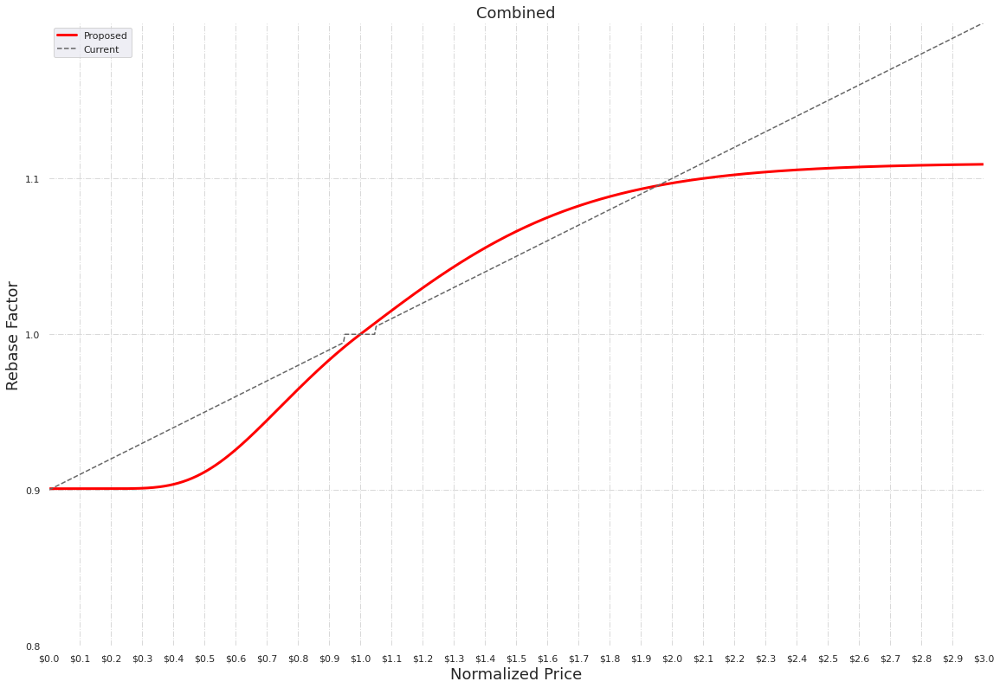
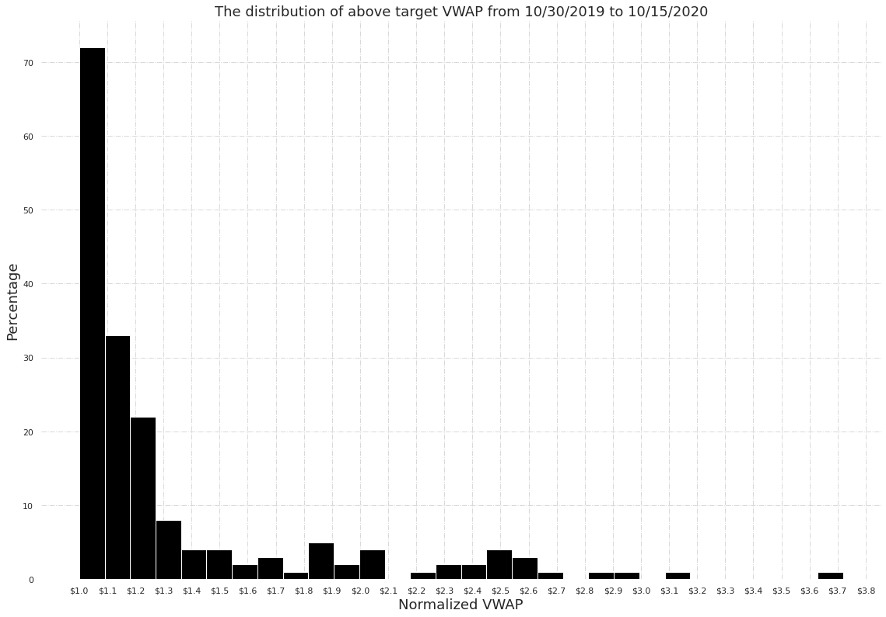
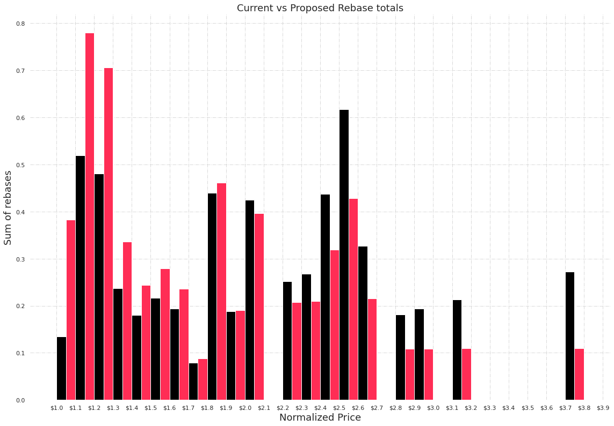

## Simple Summary
<!--"If you can't explain it simply, you don't understand it well enough." Simply describe the outcome the proposed changes intends to achieve. This should be non-technical and accessible to a casual community member.-->
The current Ampleforth rebasing function predisposes the network to short periods of rapid expansion and long periods of gradual contraction. This document proposes an update to the Ampleforth rebasing policy that would:

* Create symmetry between supply expansion and contraction.
* Limit the protocol's sensitivity to short-lived demand shocks.

The two above considerations should make the Ampleforth protocol a more balanced and robust building block for decentralized finance.

## Abstract
<!--A short (~200 word) description of the proposed change, the abstract should clearly describe the proposed change. This is what *will* be done if the AIP is implemented, not *why* it should be done or *how* it will be done. If the AIP proposes deploying a new contract, write, "we propose to deploy a new contract that will do x".-->
We propose to deploy a new contract that updates the current supply policy's linear rebasing function with a modified sigmoid-like rebasing function. 

## Motivation
<!--This is the problem statement. This is the *why* of the AIP. It should clearly explain *why* the current state of the protocol is inadequate.  It is critical that you explain *why* the change is needed, if the AIP proposes changing how something is calculated, you must address *why* the current calculation is innaccurate or wrong. This is not the place to describe how the AIP will address the issue!-->

At present, the Ampleforth rebasing function takes a `VWAP` as its input and responds to price differences of `X%` with supply changes of `(X%/rebase_reaction_lag)`. There are two things to note about this. 

1. Expansion and contraction do not react symmetrically to equal and opposite relative changes in demand. 
2. The protocol has capped rates of contraction but uncapped rates of expansion.

The protocol is more sensitive to price signals that trigger expansion, than it is to price signals that trigger contraction. Moreover the rate of expansion can vastly outpace the rate of contraction. As a result, expansions reacting to sharp but short-lived increases in price, can require prolonged periods of contraction to correct.

### Motivation for Symmetry

A supply policy is asymmetric if the magnitude of contraction is not equal to the magnitude of expansion, given identical but opposite changes in relative demand. In the case of Ampleforth, the protocol currently experiences much slower contraction than expansion. Consider the example of an alternating series below: 

**_Alternating Series Example_**

Consider a price series that alternates between $0.5 and $2, every 24hrs, infinitely:

<p align="center">

</p>

For fixed-supply assets, the `market_cap` in our example above simply alternates between two values.  This makes sense as you would expect a doubling of demand to cancel out a halving of demand. However, for any `rebase_reaction_lag` value other than 1, the current Ampleforth supply policy will drift upwards over time, forcing a correction cycle.

### Motivation for Capped Expansion Rate
 
Contraction occurs in the price range of [0,1] whereas expansion occurs in the range of [1,∞]. As a result, expansion can rapidly outpace contraction, requiring prolonged corrective periods. To this end, we also propose asymptotic limits on the rates of supply change, in order to reduce the protocol's sensitivity to short-lived, but extreme market conditions.

## Specification
<!--The specification should describe the syntax and semantics of any new feature, there are five sections
1. Overview
2. Rationale
3. Technical Specification
4. Test Cases
5. Configurable Values
-->

### Overview
<!--This is a high level overview of *how* the AIP will solve the problem. The overview should clearly describe how the new feature will be implemented.-->
The smart contract upgrade replaces the current linear rebasing function with a "balanced" sigmoid-shaped curve that horizontally asymptotes away from the price target. 

### Rationale
<!--This is where you explain the reasoning behind how you propose to solve the problem. Why did you propose to implement the change in this way, what were the considerations and trade-offs. The rationale fleshes out what motivated the design and why particular design decisions were made. It should describe alternate designs that were considered and related work. The rationale may also provide evidence of consensus within the community, and should discuss important objections or concerns raised during discussion.-->

Below we'll quickly review the basic sigmoid, and then explain the rationale for the "balanced" sigmoid proposed.

#### 1. Sigmoid
A sigmoid function takes the following shape, notice the horizontal asymptotes and the maximum slope at the target price($1):

<p align="center">

</p>

**1.1. _Sigmoid Function and Parameters_**

This equation takes, `x`, the normalized difference between `VWAP` and the price target. It returns, `Y`, the corresponding supply change percentage.

```
Y = supply change %
x = normalized price deviation
```

<p align="center">

</p>

It has shaping parameters that determine: lower asymptote, upper asymptote, and the steepness of the curve (ie: growth rate).

```
L = lower asymptote
U = upper asymptote
B = growth rate
```

#### 2. "Balanced" Sigmoid

Although the Sigmoid is a good start, we can improve upon it by transforming supply changes such that they “balance” one another. More specifically:

* If a demand-change-factor of `A` corresponds with supply-change-factor `B`.
* We want to enforce that a demand-change-factor of `1/A` corresponds with a supply-change-factor of `1/B`. 

This way, supply reactions to equal and opposite relative changes in demand, always even each other out. For more context, see the alternating series example in the motivation section above.

**2.1. _The "Balancing" Solution_**

To create multiplicative symmetry let's begin by observing that:
* <code>For every scaling factor S, there exists an inverse scaling factor S<sup>-1</sup> such that S * S<sup>-1</sup> = 1</code>

And let’s also observe that:

* <code>For every price P there exists an inverse price P<sup>-1</sup> such that P * P<sup>-1</sup> = 1</code>

We can enforce the constraint of “balanced” supply-change-factors by computing contraction supply-change-factors as the inverse of expansion supply-change-factors. In other words: 

<p align="center">

</p>

This way, for every price pair <code>{P, P<sup>-1</sup>}</code> the corresponding supply-change-factor pair <code>{S, S<sup>-1</sup>}</code> upholds the constraint that  <code>S * S<sup>-1</sup> = 1</code>.

<p align="center">

</p>

**2.2. _Balanced Sigmoid Equation and Parameters_**

Recall that the sigmoid supply change function accepts a price deviation and returns a supply change percentage. Combining it with the inversing function gives the output<sup>*</sup>: 

<p align="center">

</p>

*_<sup>\* In the equation above, P denotes normalized price, P = vwap_price/target</sup>_*

#### 3. "Balanced" Sigmoid vs Linear

We expect that the “balanced” sigmoid supply curve will cause the Ampleforth network to react symmetrically to relative demand signals, and eliminate the bias towards prolonged contraction periods.

<p align="center">

</p>

### Technical Specification
<!--The technical specification should outline the public API of the changes proposed. That is, changes to any of the interfaces Ampleforth currently exposes or the creations of new ones.-->

This update creates no changes to external APIs. Clients, including exchanges, who listen to AMPL’s rebase events still receive the absolute supply change integer as before. However, note that any external application that calculates the delta independently will need to update their calculation logic.

#### Initial Parameter Values

These parameters were set to achieve the outcomes stated above (see motivation)—while keeping the aggregate expansion rate as similar to the current protocol as possible.

Recall that the contraction curve is derived from the expansion curve through the "balancing" solution above. Thus, we need only verify that the shaping parameters selected, produce an expansion curve that generally resembles the current rebasing function. Based on this, a balanced contraction curve is constructed from the balanced_sigmoid equation as defined above. 

The proposed values are:

```
L (Lower) = -0.11
U (Upper) = 0.11 
B (Growth) = 4 
```

**_Shape Comparison_**

Below we present a chart depicting the balanced_sigmoid_shape alongside the current linear policy with (L=-.11, U=.11, B=4). 

<p align="left">

</p>

Here we can see that the:

* The Upper asymptote approaches a scaling factor of 1.11 at a price of $3.
* The Lower asymptote approaches a scaling factor of 0.9 at a price of $0.3
 
Note that the difference in shape is more pronounced for contraction than for expansion.


**_Verification_**

To verify that the proposed (sigmoid) expansion output is reasonably similar to the current (linear) output: 

1. Proposed and current supply policy functions were applied to historic `VWAP` data. 
2. Aggregate positive rebases were computed for proposed and current supply functions.
3. The ratio between proposed and current aggregate positive rebases is: **1.01**

Based on our analysis above, the set function parameters meet the goal of having similar aggregate effect on expansion rebases. This AIP only includes the verification methodology and not how those parameters were generated. We look forward to releasing a deeper dive on this in a separate blog post.

**_Normalized VWAP distribution_**

<p align="left">

</p>

**_Proposed vs Current Rebase Totals_**

<p align="left">

</p>

### Test Cases
<!--Test cases for an implementation are mandatory for AIPs but can be included with the implementation..-->
Existing unit tests will be updated with the correct calculation results to maintain test coverage

## Copyright
Copyright and related rights waived via [CC0](https://creativecommons.org/publicdomain/zero/1.0/).
