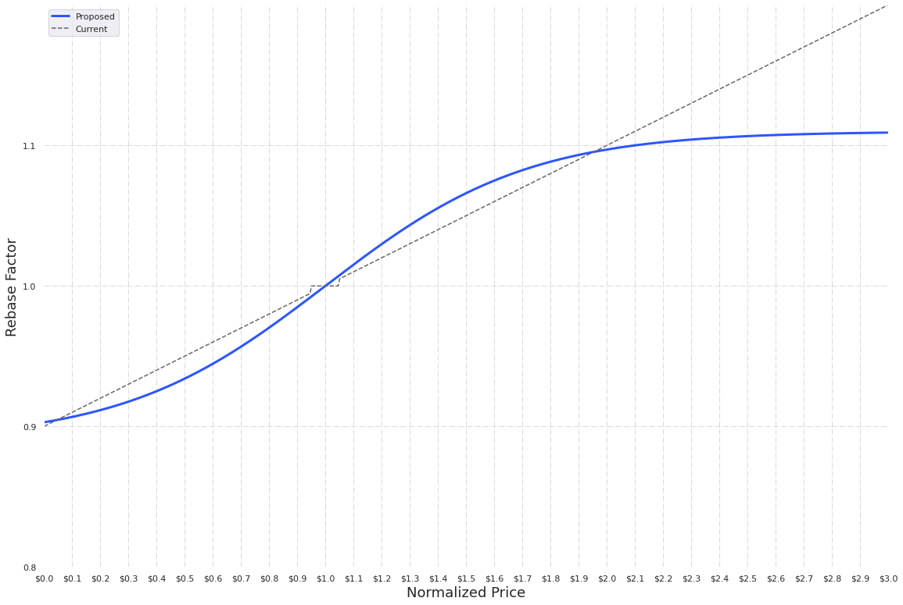
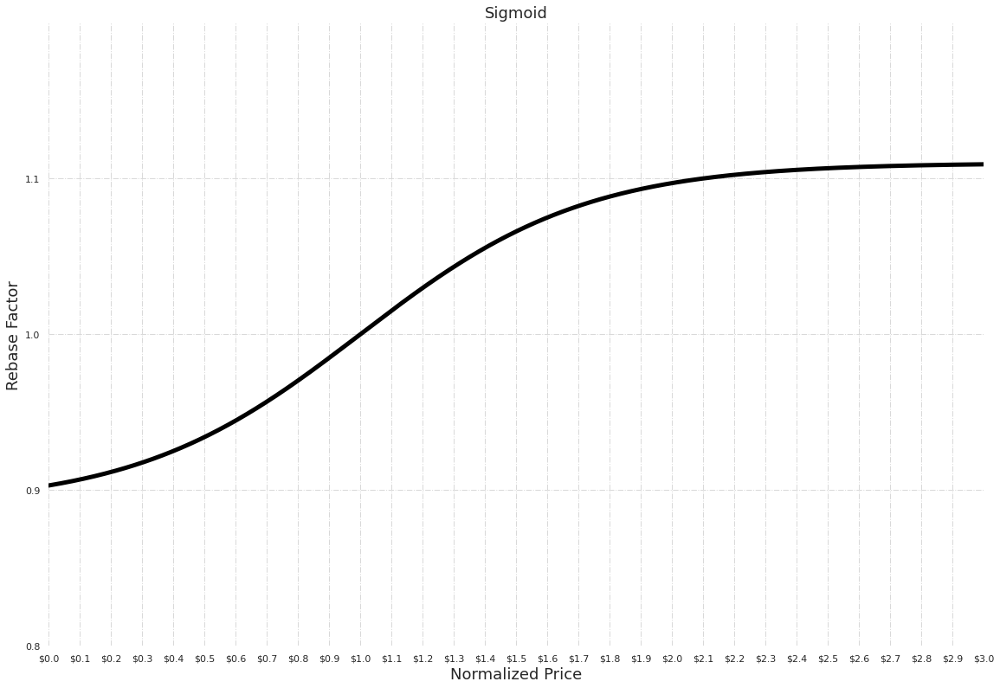
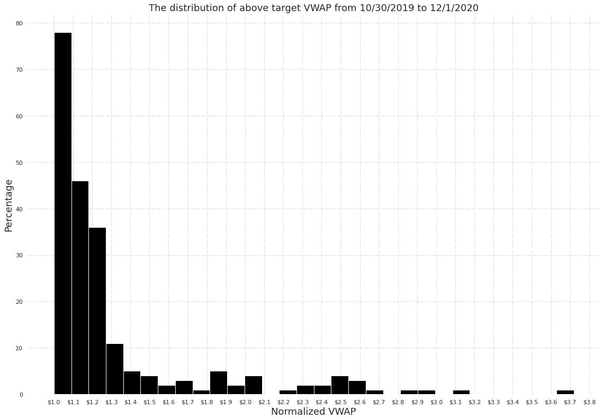
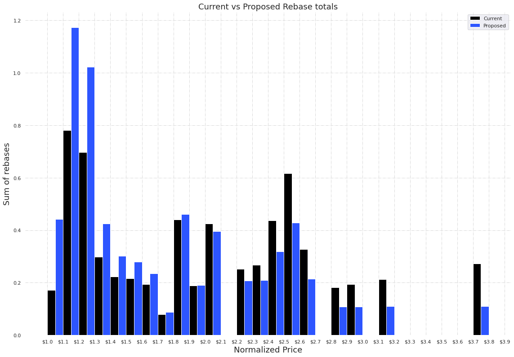

## Summary

This document proposes an update to the Ampleforth rebase policy that would limit the protocol's sensitivity to short-lived demand shocks.

This should make the Ampleforth protocol a more robust building block for decentralized finance.


## Abstract

The proposal is to deploy a new contract that updates the current supply policy's linear rebase function with a sigmoid (s-shaped) function.


## Motivation

The original Ampleforth linear rebase function was intended to make minimal assumptions about how price reacts to expansion and contraction--i.e. expansion would slow price increases by translating them into supply increases and contraction would slow price decreases by translating them into supply decreases. Hence the main purpose of the function is to point supply change in the right direction without trying to predict the magnitude of supply change needed for the fastest convergence to the price target.

Now that we have observed a year’s worth of market history and analyzed the data, we can see that extreme market scenarios can have outsized effects on AMPL supply, which then require prolonged supply corrections. The goal of this change is to:


*   Limit protocol sensitivity to short-lived, but extreme market conditions that can disproportionately change supply.

Additional side benefits from having a cap on daily supply changes:

*   Having a bound that makes AMPL supply changes relatively more predictable beyond the current day.
*   Limit the potential effect from a bad oracle price. This makes AMPL more resilient to errors and attacks and also increases the feasibility of further oracle decentralization efforts.

## Specification

The smart contract upgrade replaces the current linear rebase function with a sigmoid curve that caps supply expansions at its asymptotes 


<p align="center">

</p>


```
Rebase factor of 1.0 means no rebase.
Normalized price = VWAP price / Target price

note: x in the formula above is normalized price deviation and F(x) is the fraction of change
while the diagram for better visual representation shows the normalized price on the x-axis and the supply multiplier factor on the y-axis
```

The proposed curve above is generated by the sigmoid function:


<p align="center">

</p>


```
F(x) : fraction of supply added or removed (supply change %)
x : normalized price deviation
```


It has shaping parameters that determine: lower asymptote, upper asymptote, and the steepness of the curve (ie: growth rate).


```
l = lower asymptote
u = upper asymptote
g = growth rate
```

### Technical Specification

This update creates no changes to external APIs. Clients, including exchanges, who listen to AMPL’s rebase events still receive the absolute supply change integer as before. However, note that any external application that calculates the delta independently will need to update their calculation logic.


#### Parameter Values

These parameters were set to achieve the outcomes stated above (see motivation)—while keeping the aggregate expansion rate as similar to the current protocol as possible.

The proposed values are:


```
l (Lower) = -0.11
u (Upper) = 0.11 
g (Growth) = 4 
```


<p align="center">

</p>


```
Note that the upper asymptote approaches a scaling factor of 1.11 at a normalized price of $3.
```

To show that the proposed (sigmoid) expansion output is reasonably similar to the current (linear) output:

1. Proposed and current supply policy functions were applied to historic VWAP data.
2. Aggregate positive rebases were computed for proposed and current supply functions.
3. The ratio between proposed and current aggregate positive rebases is computed

**_Normalized VWAP distribution_**


<p align="center">

</p>

**_Proposed vs Current Rebase Totals_**


<p align="center">

</p>

Based on the analysis above, the function parameters have a ratio of 1.055 between the aggregate rebases. 

### Test Cases

Existing unit tests will be updated with the correct calculation results to maintain test coverage.


### Conclusions

This change is expected to make the ampleforth protocol more robust as a base money in decentralized finance applications.
The Ampleforth protocol will maintain the same nature to change supply to match demand.
In addition, it will be enhanced by protections against short-lived but extreme market conditions.


