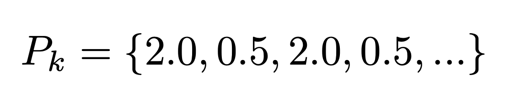
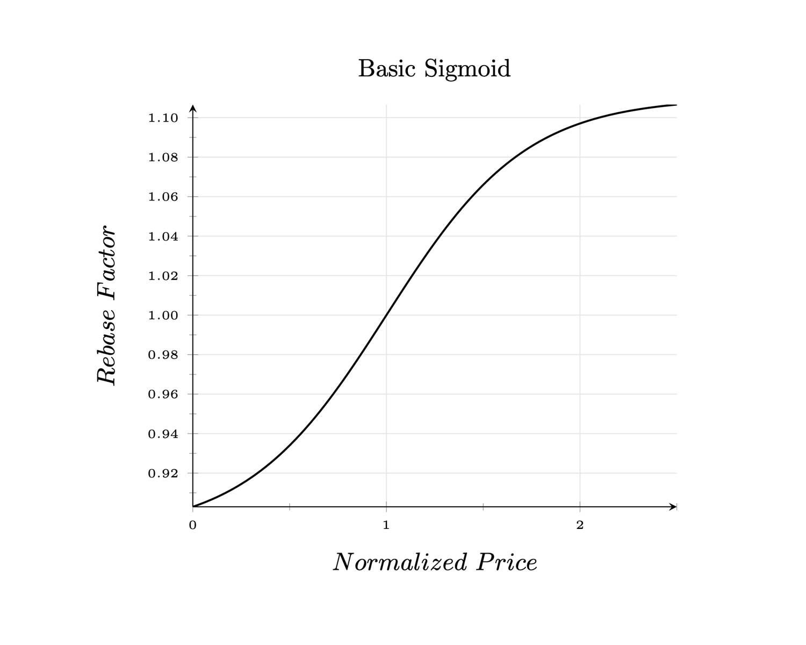
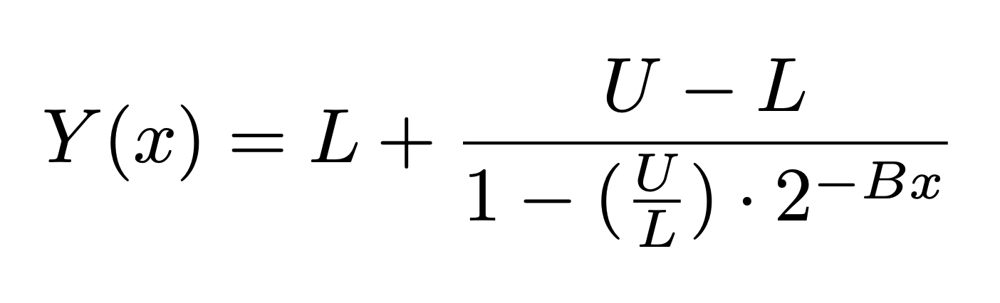
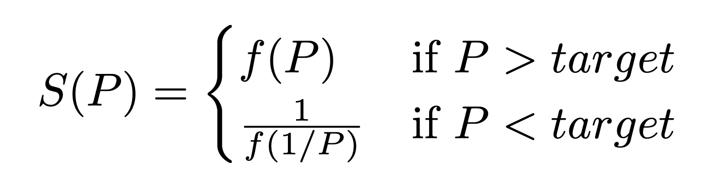
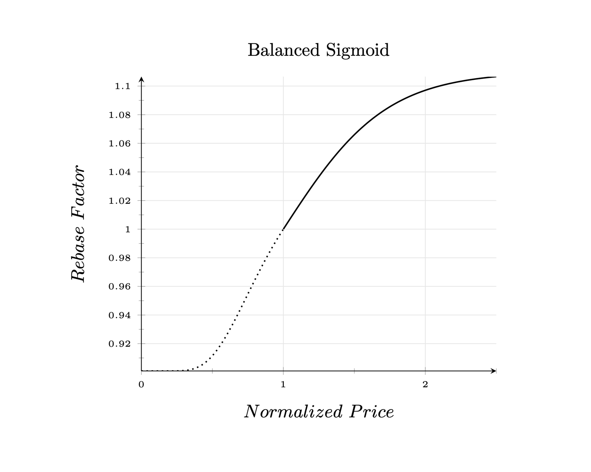
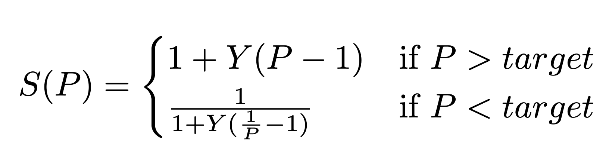
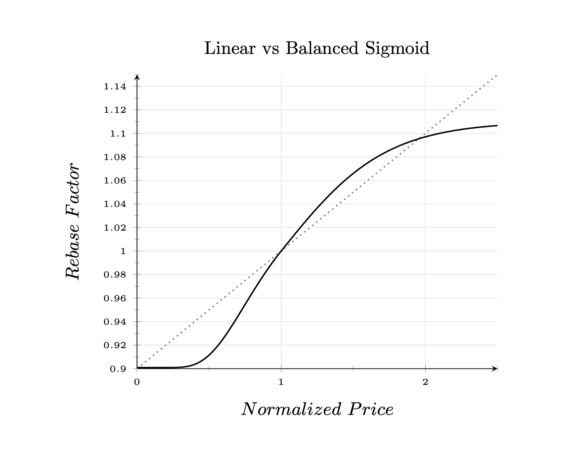

## Simple Summary
<!--"If you can't explain it simply, you don't understand it well enough." Simply describe the outcome the proposed changes intends to achieve. This should be non-technical and accessible to a casual community member.-->
The current linear supply policy reacts to demand in a way that predisposes the Ampleforth network to short periods of rapid expansion and long periods of gradual contraction. This document proposes an update to the Ampleforth supply policy that would:

* Create symmetry between expansion and contraction.
* Limit protocol sensitivity to short-lived, but extreme market conditions that can wildly expand or contract supply.

## Abstract
<!--A short (~200 word) description of the proposed change, the abstract should clearly describe the proposed change. This is what *will* be done if the AIP is implemented, not *why* it should be done or *how* it will be done. If the AIP proposes deploying a new contract, write, "we propose to deploy a new contract that will do x".-->
We propose to deploy a new contract that updates the current linear supply policy with a modified sigmoid-shaped supply policy. 

## Motivation
<!--This is the problem statement. This is the *why* of the AIP. It should clearly explain *why* the current state of the protocol is inadequate.  It is critical that you explain *why* the change is needed, if the AIP proposes changing how something is calculated, you must address *why* the current calculation is innaccurate or wrong. This is not the place to describe how the AIP will address the issue!-->

At present, the Ampleforth supply policy takes a `VWAP` as its input and offsets price differences of `X%` with supply changes of `(X%/rebase_reaction_lag)`. Two things to note about this. 

1. Expansion and contraction do not react symmetrically to relative changes in demand. 
2. The protocol has bounded rates of contraction but bounded rates of expansion.

### Motivation for Symmetry

A supply policy that reacts asymmetrically to relative changes in demand can experience unbounded supply drift in one direction or another over time. Consider the example of an alternating series below: 

**_Alternating Series Example_**

Imagine Price alternates between $0.5 and $2, every 24hrs, infinitely:



For fixed-supply assets, the `market_cap` in the example above would simply alternate between two discreet values. Similarly, for rebasing assets like AMPL, we would want the magnitude of supply changes upon expansion and contraction to perfectly offset one another. Otherwise, if they differ, there will be supply “drift” in one direction or another and the change in total supply will be uncapped over time.

In the example above, for any `reaction_lag` value other than 1, the current Ampleforth supply policy will experience uncapped supply expansion over time. 

### Motivation for Bounded Expansion

Today’s asymmetric policy has bounded contraction rates but unbounded expansion rates simply because contraction occurs in the range of [0,1] while expansion occurs in the range of [1, ∞]. As a result expansion often rapidly outpaces contraction, resulting in prolonged corrective periods.

Any symmetric policy would either be bounded on both expansion and contraction or unbounded on both expansion and contraction. We propose bounded expansion and contraction to limit protocol sensitivity to short-lived, but extreme market conditions that can wildly expand or contract supply.

## Specification
<!--The specification should describe the syntax and semantics of any new feature, there are five sections
1. Overview
2. Rationale
3. Technical Specification
4. Test Cases
5. Configurable Values
-->

### Overview
<!--This is a high level overview of *how* the AIP will solve the problem. The overview should clearly describe how the new feature will be implemented.-->
The smart contract upgrade replaces the current linear supply policy with a "balanced" sigmoid-shaped curve that: 

* Asymptotes horizontally away from the origin. 
* Steepens rates of change near the origin. 

Horizontal asymptotes eliminate the [0, 1] vs [1, ∞] range problem of heavy-tailed markets. Moreover, when rates of change happen more aggressively near the origin, the network can converge on the price-target more quickly for minor deviations.

### Rationale
<!--This is where you explain the reasoning behind how you propose to solve the problem. Why did you propose to implement the change in this way, what were the considerations and trade-offs. The rationale fleshes out what motivated the design and why particular design decisions were made. It should describe alternate designs that were considered and related work. The rationale may also provide evidence of consensus within the community, and should discuss important objections or concerns raised during discussion.-->

Below we'll quickly review the basic sigmoid, and then explain the rationale for the "balanced" sigmoid proposed.

#### 1. Basic Sigmoid
The basic sigmoid takes the following shape, note the presence of horizontal asymptotes and maximum slope near the origin:


  
**1.1. _Basic Sigmoid Equation and Parameters_**

This equation accepts as its input, `x`, the normalized difference between `VWAP` and the price target. It returns, `Y`, the corresponding supply change percentage.

```
Y = supply change %
x = normalized price deviation
```



It has shaping parameters that determine: lower asymptote, upper asymptote, and the slope of the curve (ie: growth rate) around its origin.

```
L = lower asymptote
U = upper asymptote
B = growth rate
```

#### 2. "Balanced" Sigmoid

Although the basic Sigmoid is a good start, we can improve upon it by scaling supply changes such that they “balance” one another. More specifically:

* If a demand-change-factor of `A` corresponds with supply-scale-factor `B`.
* We want to enforce that a demand-change-factor of `1/A` corresponds with a supply-scale-factor of `1/B`. 

This way, supply reactions to equal and opposite relative changes in demand, always execute in the same amount of time. For more context, see the alternating series example in the motivation section above.

**2.1. _The "Balancing" Solution_**

To create multiplicative symmetry let's begin by observing that:
* <code>For every scaling factor S, there exists an inverse scaling factor S<sup>-1</sup> such that S * S<sup>-1</sup> = 1</code>

And let’s also observe that:

* <code>For every price P there exists an inverse price P<sup>-1</sup> such that P * P<sup>-1</sup> = 1</code>

We can enforce the constraint of “balanced” supply-change-factors by computing contraction supply-change-factors as the inverse of expansion supply-change-factors. In other words: 



This way, for every price pair <code>{P, P<sup>-1</sup>}</code> the corresponding supply-change-factor pair <code>{S, S<sup>-1</sup>}</code> upholds the constraint that  <code>S * S<sup>-1</sup> = 1</code>.



**2.2. _Balanced Sigmoid Equation and Parameters_**

Recall that the basic sigmoid equation accepts a price deviation and returns a supply change percentage. Combining it with the mirroring equation gives the output: 



#### 3. "Balanced" Sigmoid vs Linear

We expect that the “balanced” sigmoid supply curve will cause the Ampleforth network to  spend a more balanced amount of time between expansion and contraction, and avert prolonged contraction periods. 



### Technical Specification
<!--The technical specification should outline the public API of the changes proposed. That is, changes to any of the interfaces Ampleforth currently exposes or the creations of new ones.-->

[Currently in progress]

### Test Cases
<!--Test cases for an implementation are mandatory for AIPs but can be included with the implementation..-->
[Currently in progress]

## Copyright
Copyright and related rights waived via [CC0](https://creativecommons.org/publicdomain/zero/1.0/).
